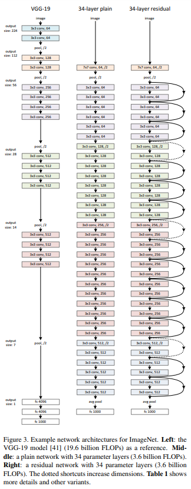

# ResNet

Paper: [Deep Residual Learning for Image Recognition](https://arxiv.org/pdf/1512.03385.pdf)

## Introduction

Problem: *The deeper network has higher training error, and thus test error.*

Solution: *Residual learning*

## Deep Residual Learning

### Residual Block and Shortcut

### Network Architectures

**Plain Network**

1. The convolutional layers mostly have 3x3 filters.
2. Downsampling is performed by convolutional layers that have a stride of 2.
3. The network ends with a global average pooling and a 1000-way fully-connected layer with softmax.

**Residual Network**

Based on the above plain network, inserted shortcut connections.

The identity shortcuts are used when the input and output are of the same dimensions. (solid line in the figure below)

When the dimensions increase (dotted line in the figure below):
1. Shortcut with extra zero entries padded for increasing dimensions. (Option A)
2. Projection shortcut done by 1x1 convolutions. (Option B)

**Architectures**

### Implementation

* Dataset: ImageNet
* Images: 224x224 crop is randomly sampled from an image or its horizontal flip, with the per-pixel mean subtracted.
* Batch normalization (BN): Right after each convolution and before activation.
* Optimizer: SGD with a mini-batch size of 256.
* Learning rate: Starts from 0.1 and is divided by 10 when the error plateaus.
* Iterations: Up to 60 x 10^4.
* Weight decay: 0.0001
* Momentum: 0.9
* Dropout: Not used. 

## Experiments

### ImageNet Classification

ImageNet 2012 classification dataset that consists of 1000 classes.

The models are trained on the 1.28 million training images, and evaluated on the 50k validation images.

A final result is obtained on the 100k test images and evaluated both top-1 and top-5 error rates.

**Deeper Bottleneck Architectures**

The three layers are 1x1, 3x3, and 1x1 convolutions, where the 1x1 alyers are responsible for reducing and then increasing (restoring) dimensions.

Option B is used for increasing dimensions. (Projection shortcut)

### CIFAR-10 and Analysis

CIFAR-10 dataset consists of 50k training images and 10k testing images in 10 classes.

The network inputs are 32x32 images, with the per-pixel mean subtracted.

The first layer is 3x3 convolutions.

The subsampling is performed by convolutions with a stride of 2.

The network ends with a global average pooling, a 10-way fully-connected layer, and softmax.

There are totally 6n+2 stacked weighted layers.

The following table summarizes the architecture:

|output map size|32x32|16x16|8x8|
|:-------------:|:---:|:---:|:-:| 
|# layers|1+2n|2n|2n|
|# filters|16|32|64|

On this dataset identity shortcuts are used in all cases. (i.e., option A)

Weight decay: 0.0001

Momentum: 0.9

BN is used but with no dropout.
