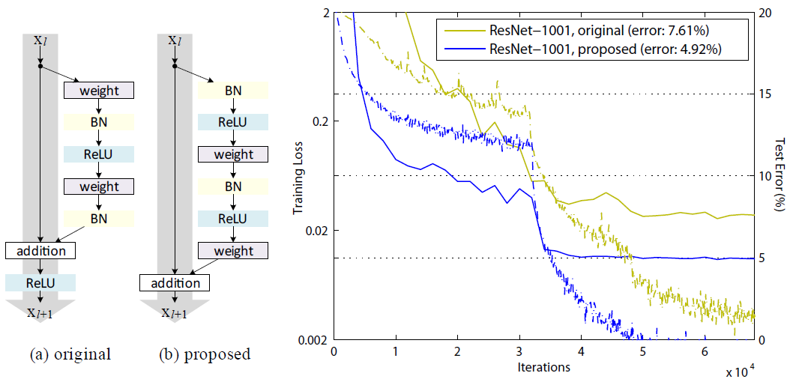
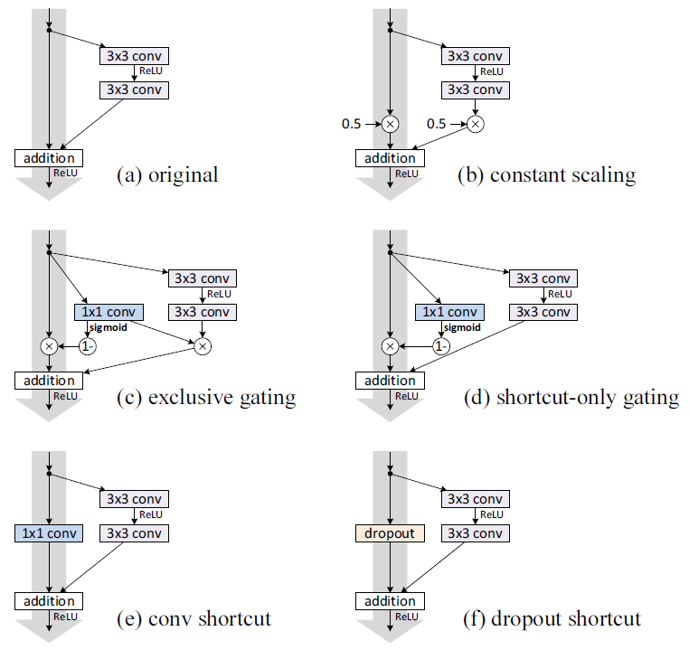
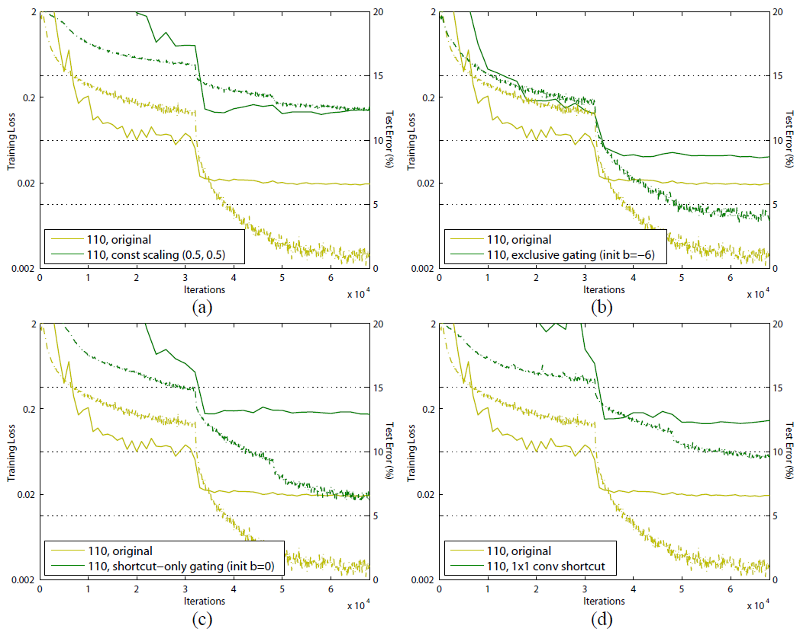
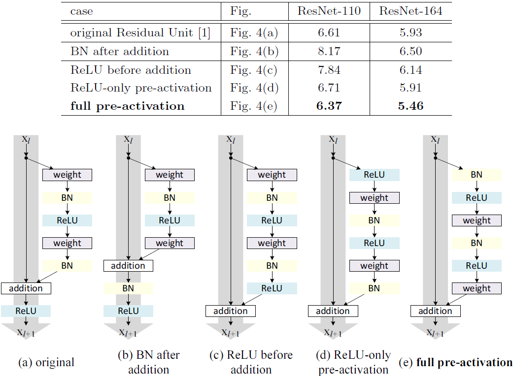
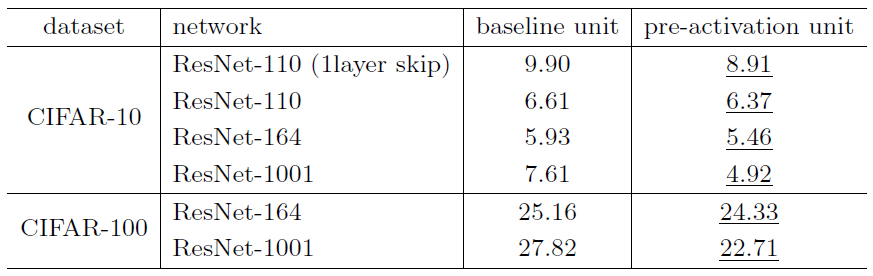
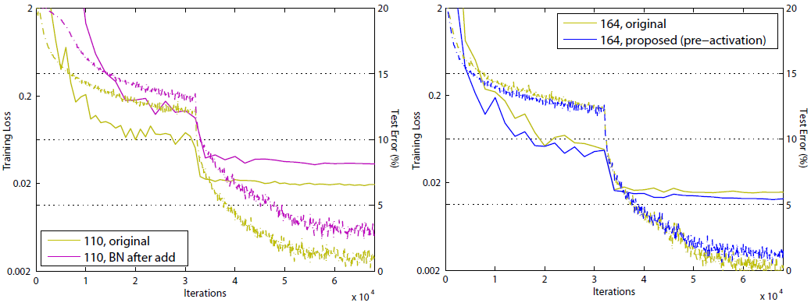

# ResNetV2

Paper: [Identity Mappings in Deep Residual Networks](https://arxiv.org/pdf/1603.05027.pdf)

## Introduction

In this paper, the deep residual networks are analyzed.

## On the Improtance of Identity Skip Connections

**Various types of shortcut connections**

**Training curves on CIFAR-10 of various shortcuts**

## On the Usage of Activation Functions

**Various usages of activation**

**Classification error (%) on the CIFAR-10/100 test set using the original residual units and pre-activation residual units**

**Training curves on CIFAR-10**

### Analysis

**Ease of optimization**

This effect is obvious when training the 1001-layer ResNet. The first figure shows the result.

**Reducing overfitting**

This phenomenon is observed on ResNet-164 when using the proposed pre-activation unit.

---

**Appendix: Implementation Details**

* The implementation details and hyper parameters are the same as those in [Deep Residual Learning for Image Recognition](https://arxiv.org/pdf/1512.03385.pdf)
* Weight decay is 0.0001
* Momentum is 0.9
* For the first residual unit (that follows a stand-alone convolutional layer, conv1), the first activation is adopted right after conv1 and before splitting into two paths.
* For the last residual unit (followed by average pooling and a fully-connected classifier), an extra activation is adopted right after its element-wise addition.
* [3x3, 16] x 2 unit in ResNet-110 is replaced with a [1x1, 16][3x3, 16][1x1, 64] unit in ResNet-164, both of which have roughly the same number of parameters.
* For the bottleneck ResNets, when reducing the feature map size we use projection shortcuts for increasing dimensions, and when pre-activation is used, these projection shortcuts are also with pre-activation.