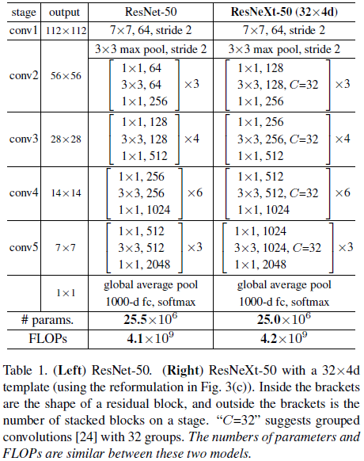
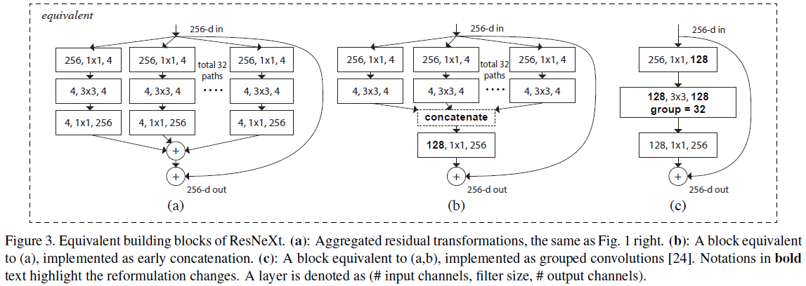
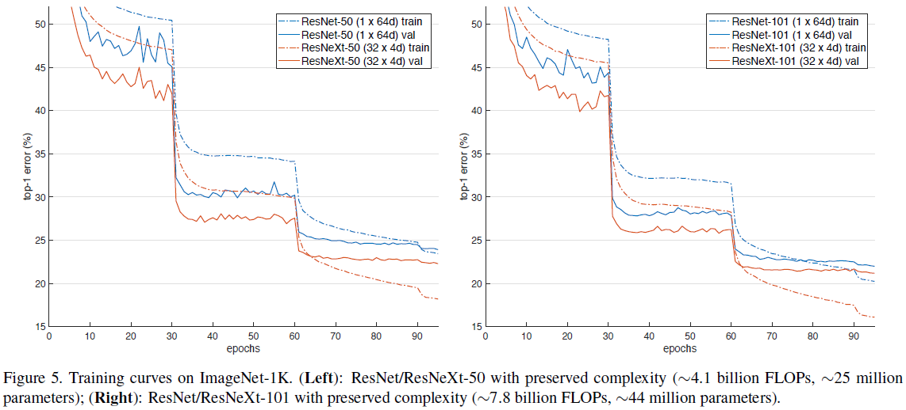
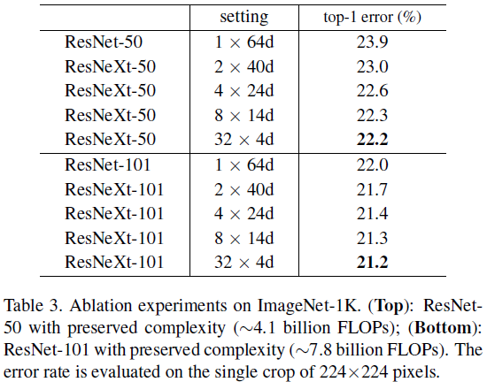
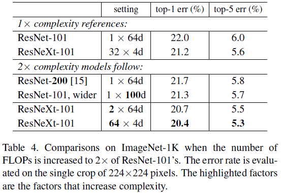
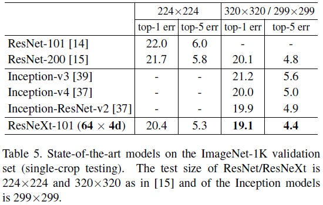
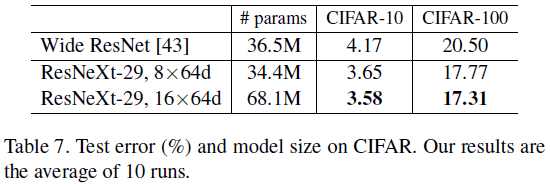
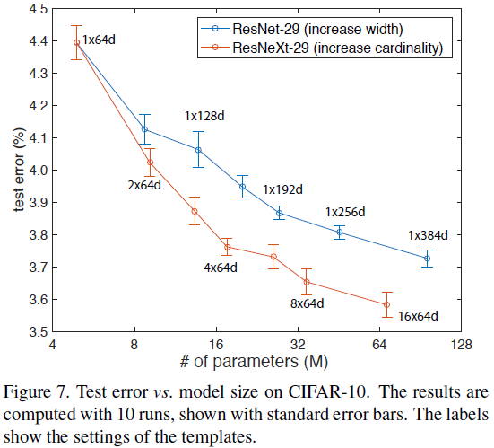

# ResNeXt

Paper: [Aggregated Residual Transformations for Deep Neural Networks](https://arxiv.org/pdf/1611.05431.pdf)

## Introduction

Inception models has been accompanied with a series of complicating factors. It is in general unclear how to adapt the Inception architectures to new datasets/tasks, especially when there are many factors and hyper-parameters to be designed.

A 101-layer ResNeXt is able to achieve better accuracy than ResNet-200 but has only 50% complexity. ResNeXt exhibits considerably simpler designs than all Inception models.

## Method

### Template

Equivalent building blocks of ResNeXt

## Implementation details
* ImageNet dataset
* 224x224 input image size
* Identity shortcuts, projections for increasing dimensions
* Downsampling of conv3, 4, and 5 is done by stride-2 convolutions in the 3x3 layer of the first block in each stage.
* SGD with a mini-batch size of 256 on 8 GPUs (32 per GPU)
* Weight decay is 0.0001
* Momentum is 0.9
* Start learning rate from 0.1 and divide it by 10 for three times using the schedule.
* Batch normalization (BN) right after the convolutions
* ReLU is performed right after each BN, after the adding to the shortcut
* Implemented by Fig.3(c) because it is more succinct and faster than the other two forms

## Experiments

### Experiments on ImageNet-1K

All blocks in ResNet-50/101 are replaced with ResNeXt blocks.

The comparisons show that increasing cardinality has better results than going deeper or wider.

### Experiments on CIFAR
* Dataset: CIFAR-10 and 100
* Bottleneck template: 
* Networks start with a single 3x3 conv layer, followed by 3 stages each having 3 residual blocks, and end with average pooling and a fully-connected classifier (total 29-layer deep)

Increasing cardinality is more effective than increasing width.