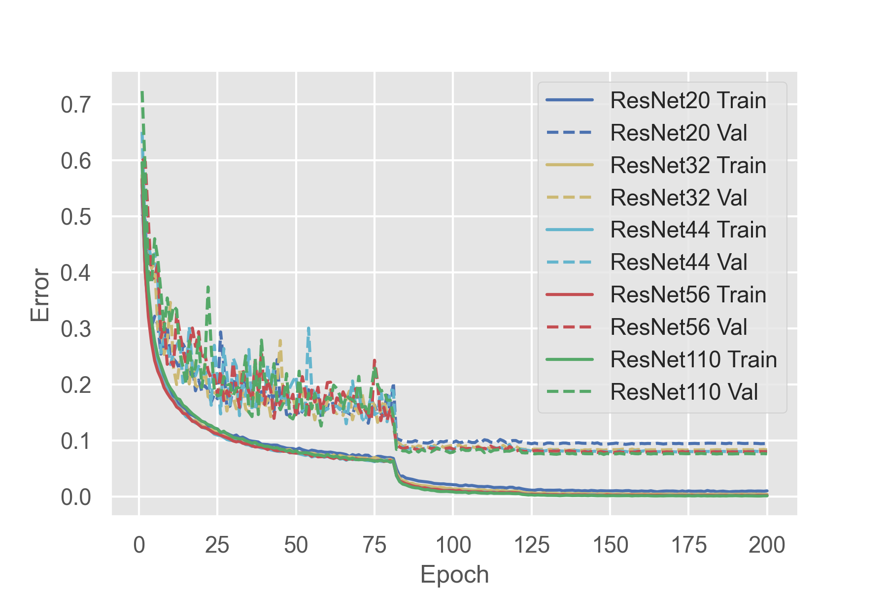
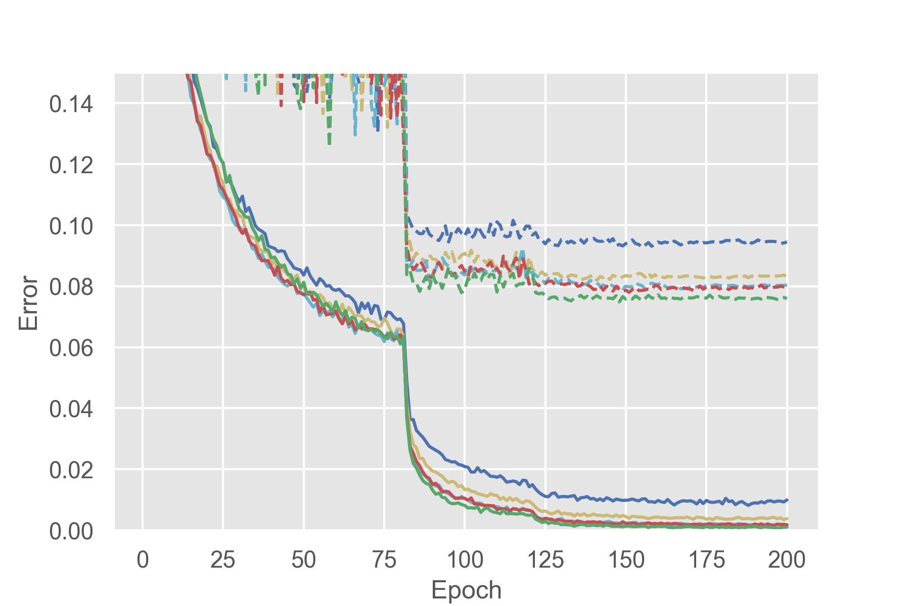

# Experiments

## ResNet

Dataset: CIFAR-10

Shortcut: Projection shortcut (Option B, 1x1 convolution)

Batch size: 128

Epochs: 200

### Classification Error on the CIFAR-10 Test Set

|model|# total params|# trainable params|error|
|-----|:------------:|:----------------:|:---:|
|ResNet20|274,442|273,066|9.28|
|ResNet32|470,218|467,946|8.19|
|ResNet44|665,994|662,826|7.91|
|ResNet56|861,770|857,706|7.80|
|ResNet110|1,742,762|1,734,666|7.49|

